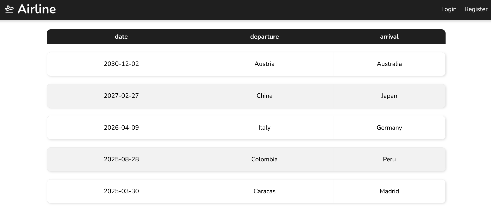
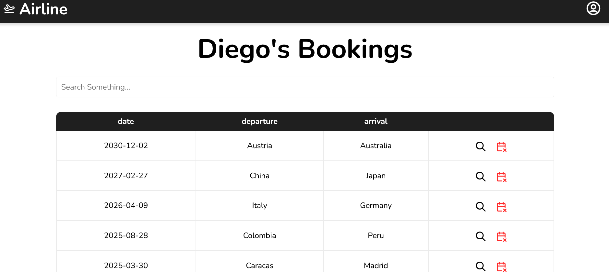
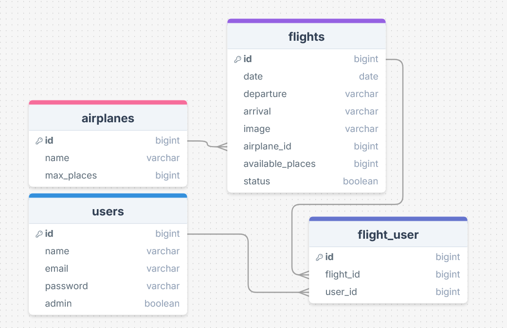
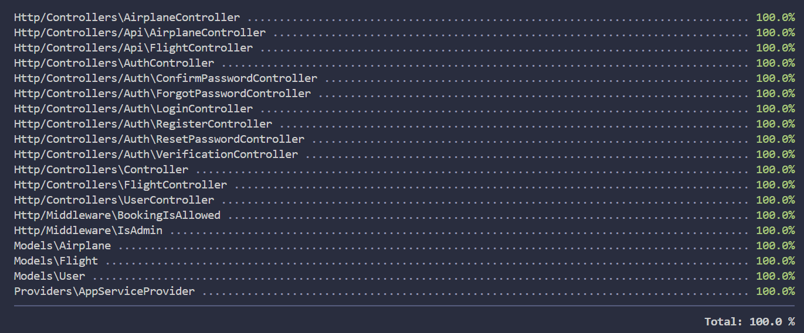

# ✈️ Job Search


Airline is a flight booking website that lets you manage your bookings the way you want. Sign in to enjoy all the features the app offers.

## ⭐ Characeristics

* __Book and cancel flight reservations__.

* __A search bar to filter available flights__.

* __A dashboard to view all your future and past bookings__.




## 📦 How to Install

### Prerequisites:

* __PHP language version 8.2 or above:__ https://www.php.net/downloads.php.

* __MySQL Database:__ https://dev.mysql.com/downloads/.

* __Composer dependency manager for PHP:__ https://getcomposer.org/.

* __Node.js latest stable version:__ https://nodejs.org/en.

### Installation Steps

1. Clone the repo:

```
git clone https://github.com/Equipo-3-Hackaton-Globant/ReadersMatch.git
```

2. Inside the cloned repository, install the required dependencies:

```
composer install && npm install
```

3. Copy `.env.example` and create a new file called `.env`:

```
cp .env.example .env
```

4. Generate a new key for laravel:

```
php artisan key:generate
```

5. Check that the MySQL service is running and then migrate the database by running the command below:

```
php artisan migrate
```

Once you've done all the previous steps finally you can initialize the server and start using the application:

```
npm run build && composer run dev --timeout 1000000
```

## 🌐 API Endpoints

The application integrates JWT to manage user authentication when consuming the API, meaning that you must employ the login endpoints before making requests to any other endpoint. Below you will see a list containing all the available endpoints alongside their respective methods and json structure (if they possess one).

### Authentication

> __POST__ /api/auth/register
```
{"name", "email", "password", "password_confirmation"}
```

> __POST__ /api/auth/login
```
{"email", "password"}
```

> __POST__ /api/auth/me

> __POST__ /api/auth/refresh

> __POST__ /api/auth/logout

---

### Airplanes

> __GET__ /api/airplanes

> __GET__ /api/airplanes/{id}

> __POST__ /api/airplanes (Admin Only)
```
{"name", "maxPLaces"}
```

> __PUT__ /api/airplanes/{id} (Admin Only)
```
{"name", "maxPLaces"}
```

> __DELETE__ /api/airplanes/{id} (Admin Only)

---

### Flights

> __GET__ /api/flights

> __GET__ /api/flights/{id}

> __POST__ /api/flights (Admin Only)
```
{"date", "departure", "arrival", "image", "airplaneId", "availablePlaces", "status"}
```

> __PUT__ /api/flights/{id} (Admin Only)
```
{"date", "departure", "arrival", "image", "airplaneId", "availablePlaces", "status"}
```

> __DELETE__ /api/flights/{id} (Admin Only)

## 🐬 Database Diagram



## 🧪 Tests

To test the application execute the command below:

```
php artisan test
```



## 🛠️ Languages and Tools Used

### Front End:

[](https://skillicons.dev)

### Back End:

[](https://skillicons.dev)


## 🧑‍💻 Author

__Diego Santamaria, Backend Developer.__

[](https://github.com/DinGo21/)
[](https://www.linkedin.com/in/diegosm21/)
