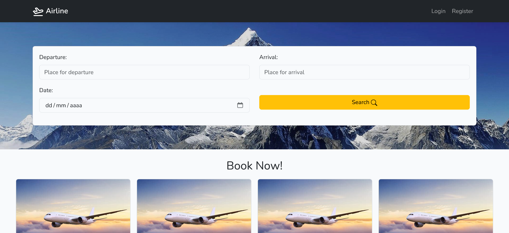
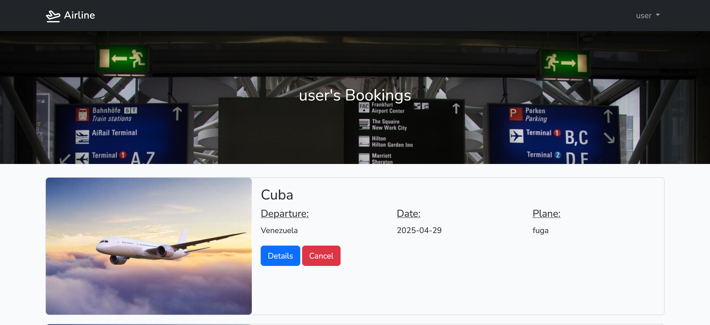

# Job Search


## About

Airline is a flight booking website that lets you manage your bookings the way you want. Sign in to enjoy all the features the app offers.

### Characeristics

* Book and cancel flight reservations.
* A search bar to filter available flights.
* A dashboard to view all your future and past bookings.




## installation

### Pre-requisites

* PHP 8.0 or above
* Composer
* Relational database engine (Mysql/Sqlite)
* Node.js

### Steps

1. Clone the git repository:

```
git clone https://github.com/DinGo21/Airline.git
```

2. Enter inside the folder and install all dependencies by running the next command:

```
composer install && npm install
```

3. Copy and paste the '.env.example' file and rename it to '.env', then uncomment the lines ranging from 25 to 29.


4. Change the variable `DB_CONNECTION` to the database engine you are currently using, and also name your main database inside `DB_DATABASE`.

5. generate the encryption key to get access to the database:

```
php artisan key:generate
```

6. Migrate the database and tables:

```
php artisan migrate
```

7. Last thing is to initialize the server to begin using the website by running the line below:

```
npm run build && composer run dev
```

## Languages and Tools Used

<div align="left">
  
  
  
  
  
  
  
  
  
  
  
  
</div>


## Authors

* Diego Santamaria: 

<div align="left">
  <a href="www.linkedin.com/in/diegosm21" target="_blank">
    
  </a>
</div>